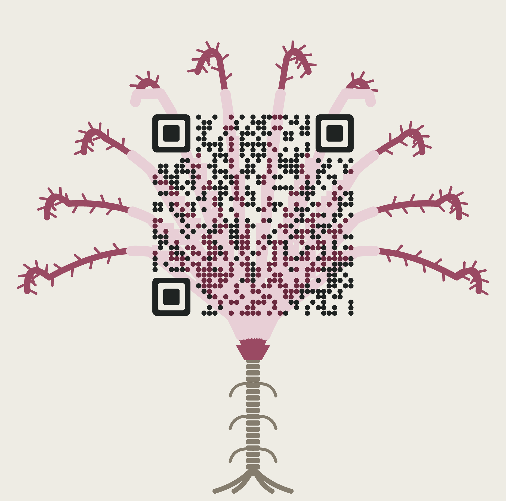

# Hold On

*the life of a crinoid, in ten seasons or fewer*

**Play:** https://syntaxswine.github.io/crinoid-life/

A short choose-your-own-adventure. You are a crinoid — a sea lily, which is an
animal, a cousin of the starfish, built from tens of thousands of plates of calcite.
Choose an era (the Carboniferous meadow, or the present-day deep), find
something hard to hold on to as a larva, and live ten seasons of feeding,
storms, urchins, fish, and tenants. Eleven endings, remembered in your browser.

Same voice as [Twenty-One Pages](https://syntaxswine.github.io/cheesecake-cyoa/):
deadpan, second person, and every fact is real.

The QR code above scans to this repo. It is a sea lily: ten arms rise from
the cup and pass *through* the code as a tint that keeps every module's
light/dark value (dark modules turn deep rose, light modules pale rose), so
the bits are unchanged; version 5, error correction H. `tools/make_qr.py`
rebuilds it and refuses to write a pass unless two independent decoders
read it back: ZXing at every size down to 3px/module, blurred, and in
greyscale; OpenCV at 4–10px/module. A plain code is decoded first as the
control. Under simulated phone capture (tilt, perspective, dim exposure,
JPEG q40) ZXing read it 40/40.

## Trailer

**Watch the trailer** on the game's title screen, or [download it](https://github.com/Syntaxswine/crinoid-life/releases/tag/trailer-v1) —
73 s, vertical (1080×1920), made for a phone.

The narrator speaks a consistent invented language, synthesised by
[babble-lab](https://github.com/Syntaxswine/babble-lab), while the real words
type out in the text box on the same schedule the voice speaks them. Every
frame is drawn procedurally from one function of time (`video/trailer.html`).

Rebuild: `cd video && npm install && node render.mjs` (needs babble-lab
checked out beside this repo, Chrome, and `pip install imageio-ffmpeg`).
`node stills.mjs 5 30 51` renders a contact sheet at those seconds.

## Files

- `index.html` — the whole game, one self-contained file, no build.
- `qr-crinoid.svg` / `qr-crinoid.png` — the QR code (SVG for print, PNG at 20px/module).
- `tools/make_qr.py` — builds and decode-checks it (`pip install segno pillow opencv-python-headless zxing-cpp`).

## The facts

Real: mouth and anus both on the upper surface; non-feeding yolky larvae
(sea lilies too: Nakano et al. 2003); stalked crinoids crawling away from
cidaroid urchins at 10-30 mm/s (Baumiller & Messing 2007), and cidaroid bite
marks back to the Triassic (Baumiller et al. 2010); platyceratid snails
fossilised in place on crinoid anal vents, and infested crinoids growing
smaller (Gahn & Baumiller 2003); each plate a single calcite crystal;
crinoidal limestone (the Burlington, across Missouri, Iowa and Illinois), and
Missouri limestone polished and sold as "marble" for the State Capitol
(Missouri DNR); Crawfordsville, Indiana, buried by storm-driven silt off a
delta; St Cuthbert's beads on Lindisfarne and the anvil legend (1783, and
Scott's *Marmion*); the crinoid as Missouri's state fossil (1989), and
Indiana's mastodon (2022); about 95 stalked species among six or seven hundred.

Corrected in a fact-check (2026-09-29):

| Was | Now | Why |
|---|---|---|
| "a few thousand" plates | tens of thousands | counting brachials and pinnulars, the arms alone of a small ten-armed feather star hold ~15,000; published estimates put most crinoids above 200,000 |
| diatoms in the Carboniferous | tiny algae | the oldest diatoms are ~200 My younger |
| "you had 480 million years", at 340 Ma | 140 million | the family started ~480 Ma |
| a copepod passes the Carboniferous larva | a conodont | the oldest copepod fossils are ~303 Ma |
| the Carboniferous meadow "will one day be Missouri" | "near the equator" | the endings put you in Indiana and Northumberland |
| any adult sea lily can become a feather star | only in seasons 1-3 | feather stars drop the stalk as juveniles; an adult sea lily crawls but never swims |
| crinoid shrimp and clingfish on a deep sea lily | brittle star, eulimid snail | those two live on shallow-reef feather stars (8-25 m) |
| myzostomids live "on crinoids and nowhere else" | nine in ten do | about ten species live on starfish and brittle stars |
| "When you can see again" | "You have no eyes" | crinoids have none |
| "a hundred-odd metres down" | a few hundred | 100-150 m is the shallowest extreme |
| "a metre of mud" | storm silt off a delta | no source for the thickness; the delta is Crawfordsville's |

Compressed for play: season lengths, odds, and the choice of era. No crinoid
gets to choose its geological period.

## Balance

Measured by bot play: careful present-day play starves ~4% of the time;
the "cup on a stick" ending needs reckless play. All eleven endings are
reachable.
